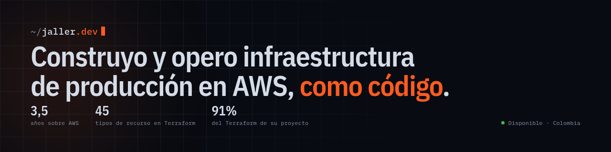
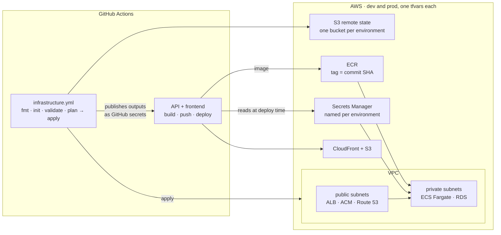

**Platform / Cloud Engineer** · Colombia · available on-site, hybrid or remote

I build and operate production infrastructure on AWS, defined as code. Three and a half
years across cloud platform work, backend services, and the pipelines that ship them.

Currently full stack engineer at **[InvitiApp](https://invitiapp.com)** — Next.js on AWS
Lambda, S3 and CloudFront.

---

### The work, with numbers attached

On the platform I built for a booking SaaS, **91% of the live Terraform is mine** —
3,010 of 3,317 lines by `git blame` — and **all 9 pull requests** in the infrastructure
repository are mine, `#1` through `#9`. The repo opens with my first one, because before
that there was no infrastructure and no way to deploy.

| | |
|---|---|
| **8** | Terraform modules written from zero |
| **45** | AWS resource types declared |
| **2** | isolated environments, driven by per-environment `tfvars` |
| **5** | CI/CD pipelines, infrastructure and applications |
| **61%** | of that project's bill was one NAT Gateway — $45 of $74, found by breaking the invoice down component by component |

### What it looks like

The arrow that matters is the dashed one in the middle: when the apply finishes it writes
Terraform's outputs back as repository secrets, so the application pipeline discovers the
cluster, the registry and the database endpoint on its own. Nobody copies a value by hand,
and nothing drifts.

---

<b>Stack</b>

 

| | |
|---|---|
| **AWS** | EC2 · ECS/Fargate · Lambda · Step Functions · API Gateway · S3 · VPC · RDS · DynamoDB · SQS · EventBridge · CloudWatch · IAM · Secrets Manager |
| **IaC & delivery** | Terraform · Docker · Kubernetes · Helm · GitHub Actions · Jenkins · Octopus Deploy · Nginx · Linux |
| **Backend** | TypeScript · Node.js · NestJS · Hono · PostgreSQL (Drizzle, Row Level Security) · Redis · Python |
| **Frontend** | Next.js 15 · React 19 · Tailwind CSS |

<b>Observability and cost, as code</b>

 

New Relic alert policies declared in Terraform and routed to a Teams channel, so an alert
is reviewed in the pull request rather than after the outage. CloudWatch for logs and
metrics. IAM roles scoped per service and per environment, not shared credentials.

On compute: ECS on Fargate over EKS, chosen after breaking the bill down component by
component — the control plane alone cost more than the rest of the project's
infrastructure. `FARGATE` and `FARGATE_SPOT` as capacity providers, tasks sized to the
minimum they actually need.

---

### Built on my own

**[Hummik](https://hummik.com)** — WhatsApp scheduling for businesses in Colombia.
Fully serverless on AWS with SST v3: Hono on Lambda, SQS with dead-letter queues, crons.
Real multi-tenancy — the tenant comes from a verified JWT claim and is enforced with
Postgres Row Level Security, so isolation lives in the database and not in an
application `if`. Ports and adapters over a pnpm monorepo with an I/O-free core.
**841 tests**, most of them over pure logic, which is why they run in seconds.

**[HalcónOS](https://halcon.jvagencia.com)** — CRM with lead discovery over the Google
Places API. Next.js 15, tRPC, Drizzle, multi-tenant with organization-scoped RBAC enforced
at the tRPC layer. Separate Python + Playwright scraping service.

---

### Reach me

**[Portfolio](https://jaller-dev.vercel.app)** · **[LinkedIn](https://linkedin.com/in/jallerdev)** · jallerangel06@gmail.com

English: B2 measured — <a href="https://cert.efset.org/es/TEDwXS">EF SET 55/100</a>, C1 reading. I work in English documentation, code and issues every day.
